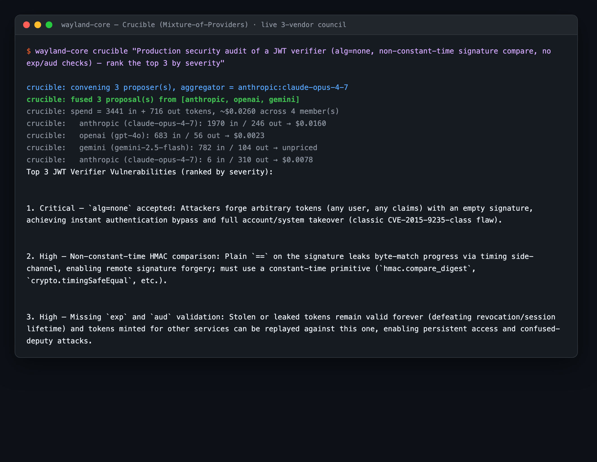
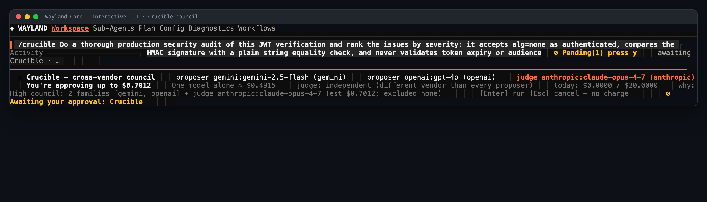

# Crucible (Mixture-of-Providers council)

Crucible is wayland-core's **cross-provider council**. It fans a single task out
to *N* proposer sub-agents — each pinned to a **different** LLM provider, each
using that provider's own API key — then a separate **aggregator** (the "judge")
fuses the proposals into one answer. It is a Mixture-of-Providers (MoP) design:
instead of trusting one model, you put several vendors' best models in a room,
let them answer independently, and have a cooler-running judge reconcile them.

Crucible is **opt-in and OFF by default**. It is **BYO-keys**: every council
member is resolved to a keyed provider from your own `[providers]` config, so you
only ever run the models you've already connected. The whole council is
**read-only by construction** — proposers and the judge get no `Bash`/`Write`/`Edit` —
and because it costs roughly *N×* a single call, it ships with first-class cost
controls.



## When to use it

Use Crucible for high-stakes, single-shot questions where a second (and third)
opinion is worth the spend: security audits, architecture reviews, cross-checking
a plan, comparing designs. For routine work, leave it off — a normal single-model
session is cheaper and faster.

It is deliberately a *deliberation* tool, not an everyday driver. The default
caps (a soft $20/day envelope, per-stakes ceilings on the auto path) and the
pre-flight approval card exist precisely because a council is more expensive than
one call.

## Enabling it

Crucible does nothing until you turn it on. With it disabled, `wayland-core crucible`
exits with an error telling you to set `enabled = true` and list `proposers`.

Minimal config in your `[crucible]` block:

```toml
[crucible]
enabled = true
proposers = ["openai", "anthropic:claude-opus-4-8"]
```

A partial table backfills every omitted bound from its default
(`min_proposers = 1`, `max_proposers = 5`, `proposer_deadline_s = 90`,
temperatures `0.6`/`0.4`, `mode = "terminal"`, `daily_cap_usd = 20`), so you only
write the fields you want to change.

Each proposer spec resolves to its own keyed provider from your on-disk
`[providers]` map. A member whose credential can't be resolved is **skipped, not
fatal** — the council runs with whoever has a working key — while an unknown
provider id is reported as an error. (The exact provider/auth field names live in
the `[providers]` config; see [providers.md](providers.md).)

### Provider spec format

A proposer/aggregator spec is either:

- `"provider"` — the provider's default model, or
- `"provider:model"` — a specific model.

Exactly one `:` is allowed; an empty provider, a trailing `:`, or `a:b:c` are
malformed. Flux routes use the form `flux-router:flux-pinned-<model>`. Crucible
canonicalizes families so the *same* model never counts as two diverse picks: a
`flux-pinned-*` model maps back to its underlying vendor, and
`openrouter:<vendor>/<model>` is canonicalized to the upstream vendor.

## Running it

The command is `wayland-core crucible "<task>"`. The task is a single quoted
positional argument.

```bash
wayland-core crucible "cross-audit this security plan"
```

By default this runs **manual mode**: the roster is taken verbatim from your
`[crucible].proposers`/`aggregator`, and the council always convenes.

### Flags

| Flag | Effect |
|------|--------|
| `--auto` | Manual roster, but **gate first**: a cheap classifier decides convene-vs-direct (a trivial ask answers with one direct call). Without `--auto` the manual council always convenes. |
| `--council <spec,spec,...>` | Pin the **auto** candidate pool to exactly these comma-separated specs (forces auto mode). |
| `--judge <provider:model>` | Pin the auto aggregator/judge; the roster is re-priced and the tier cap re-checked (warns if it now exceeds the cap). |
| `--direct` | Force a single direct answer (auto mode). |
| `--force-council` | Force convening a council regardless of the gate (auto mode); Med stakes, or High with `--deep`. |
| `--deep` | Treat the task as High stakes — widest roster + strongest judge (auto mode). |
| `--deny <family,family,...>` | Exclude these provider families from an auto roster (forces auto mode). |
| `--advisor` | Inject the fused synthesis into the normal **trusted** agent loop as fenced private guidance, instead of print-and-stop. Overrides `[crucible].mode`. |
| `--terminal` | Force terminal (print-and-stop) mode, overriding `[crucible].mode`. Mutually exclusive with `--advisor` (usage error if both). |

Any of `--council`, `--judge`, `--direct`, `--force-council`, `--deep`, or
`--deny` switches Crucible into **auto** assembly (below), as does
`assembly = "auto"` in config.

## Manual vs auto assembly

**Manual** (default, `assembly = "manual"`): the roster is your `proposers` list
plus `aggregator`, used exactly as written. This is the predictable, shipped path —
you decide who's on the council.

**Auto** (`assembly = "auto"`, or any auto-triggering flag): a **pure
deterministic** assembler picks a cost-effective, provider-diverse roster from
your keyed candidate pool, prints a pre-flight plan card, and waits for approval
before spending. The assembler:

- classifies stakes and sizes the roster accordingly (see the gate below),
- reserves the **strongest** provider family as a *decoupled* judge — it is never
  also a proposer,
- requires **≥ 3 priced families** for a real council; with fewer it falls back
  to a single strong Direct answer,
- excludes deny-listed families and unpriceable specs,
- applies an intra-family price floor (a flash/mini SKU can't take a slot a
  flagship should hold),
- fits the roster under the stakes-tier cost cap with a **downshift ladder**:
  downshift the judge → drop the priciest proposer → fall to a single Direct.

### The gate (Low / Med / High stakes)

The gate (`classify_task`) is a **cheap, deterministic keyword + length
heuristic** — no LLM call, no token spend. A high-signal keyword in the leading
instruction span marks the task **High**; any other signal, or a task of ≥ 40
words, marks it **Med**; otherwise it's **Direct** (Low). Stakes map to proposer
count:

| Stakes | Proposers |
|--------|-----------|
| Low | 0 (a single direct answer) |
| Med | 3 |
| High | 5 |

The count is clamped to `max_proposers` and to the number of available candidate
families. For example, "What day is today?" routes Direct, while "Do a detailed
security audit of this deployment plan" (or any 40+-word task) convenes a council.

On the manual path the gate only runs when you pass `--auto`; otherwise the
manual council always convenes.

## Proposers, aggregator, and fusion

Proposers run **hotter** for diversity (`proposer_temperature`, default `0.6`);
the aggregator runs **cooler** for convergence (`aggregator_temperature`, default
`0.4`). Both are clamped to `0.0..=2.0` (NaN/inf → `0.0`) before reaching the
wire.

An `LlmSynthesisAggregator` pinned to your configured `aggregator` provider fuses
the usable proposals. If no aggregator is set or resolvable, or it errors, the
council falls back to the **first usable proposal verbatim** — you always get an
answer. The aggregator spec is validated against known built-in providers/aliases
at config load.

**Quorum and tail-latency.** At least `min_proposers` usable (non-error,
non-blank) proposals are required — always ≥ 1 — or the run fails with an
insufficient-proposals error. Each proposer has a hard `proposer_deadline_s` (90s)
backstop. Once quorum is met, the soft `global_deadline_s` (25s) cancels
stragglers. `proposer_concurrency` (4) caps concurrent spawns that share one
credential prefix, so a `flux:*` roster doesn't thundering-herd a single key.

## Security: prompt-injection fencing

Crucible treats every proposal as untrusted input to the judge. Each proposal is
wrapped in `[UNTRUSTED DATA]` markers with a security preamble, and any
boundary-marker tokens inside a proposal's text are neutralized with a zero-width
space — a proposal can't forge a closing delimiter to break out of its fence.

The aggregator runs **read-only** (no `Bash`/`Write`/`Edit`), so even a
successful injection inside a proposal can't reach a side-effecting tool. In
advisor mode (below) the synthesis is re-fenced as `[UNTRUSTED DATA]` before it
ever reaches the trusted loop.

## Advisor vs terminal mode

How the fused answer is consumed:

- **Terminal** (default): print the fused synthesis and stop. Fully read-only.
- **Advisor** (`--advisor` or `mode = "advisor"`): re-fence the synthesis as
  `[UNTRUSTED DATA]` at the tail of the user turn, then run the **normal trusted,
  full-tool** main agent loop over it. The agent reasons and acts on the council's
  guidance instead of just echoing it.

Precedence: `--advisor` wins, then `--terminal`, else `[crucible].mode`. Passing
both `--advisor` and `--terminal` is a usage error.

## Cost and budget gating

Because a council is *N×* a single call, spend is governed at three levels.

- **Per-run hard cap** — `max_cost_usd` (default `None`) is **strict**: an
  unpriceable roster under it is refused, and an over-estimate is rejected as
  over-budget. `None` means no per-run cap.
- **Daily cap** — `daily_cap_usd` (default `$20`) is **soft**: it binds only on a
  priceable roster, pre-checking `spent + certified > cap`. *Note: in the current
  build this accumulates per-process within a single CLI invocation; cross-process
  daily persistence is a later stage, so the envelope does not yet bind across
  separate `wayland-core crucible` calls.*
- **Stakes-tier auto caps** — `cap_low_usd` / `cap_med_usd` / `cap_high_usd`
  (`$0.02` / `$0.05` / `$0.15`) bound the auto assembler. When a roster doesn't
  fit, the downshift ladder kicks in (downshift judge → drop priciest proposer →
  single Direct). Raise `cap_high_usd` (or use `--deep`) to widen a High plan.

**No surprise spend.** The auto path prints a typed proposal card and requires
approval. In a non-TTY (headless/CI) session it **fails closed** unless
`crucible_auto_spend = true` (default `false`). The card always renders
`price unknown` (never `$0`) for an unpriceable ceiling.

After a run, a provenance line is printed to stderr, e.g.:

```
crucible: skipped proposer 'vertex' (provider 'vertex' has no usable api key)
crucible: fused 2 proposal(s) from [anthropic, openai]
crucible: spend = 180 in + 90 out tokens, ~$0.0020 across 2 member(s)
```

## The council card (TUI)

In the TUI, the same typed plan renders on the approval rail: a scale glyph,
per-member proposer/judge rows (the judge accented), a `You're approving up to
$X.XXXX` ceiling, a `One model alone ≈ $X.XXXX` baseline, a judge-independence
line, a `today: $spent / $cap` daily line, and the reason/trims trace. Keys are
`[Enter] run` and `[Esc] cancel — no charge`.



## Empty-state bootstrap

When both `proposers` and `candidate_pool` are empty, the auto path falls back to
a default Flux pool (flux-pinned `gpt-5` / `claude-opus-4-7` / `deepseek-v4-pro` /
`gemini-2-5-pro`) so `/crucible` works as soon as you've connected a Flux key.

## Privacy-safe learning log

With `log_assembly = true` (default `false`), each auto council appends one JSON
line to `crucible-assembly.jsonl` under your user config directory, recording
**only** the stakes class, provider-family mix, aggregator family, and
estimated-vs-actual cost. It never logs task text, trims, model specs, or keys.

## Configuration reference

All fields live under `[crucible]`.

| Field | Type | Default | Meaning |
|-------|------|---------|---------|
| `enabled` | bool | `false` | Kill-switch. OFF keeps the council inert; the CLI errors unless this is true. |
| `proposers` | list of string | `[]` | Provider specs (`"provider"` / `"provider:model"`), one per proposer. |
| `candidate_pool` | list of string | `[]` | Extra `provider:model` specs the **auto** assembler may draw from; ignored on the manual path. |
| `aggregator` | string (optional) | none | Spec for the judge that fuses proposals; none → first usable proposal. Validated at load. |
| `min_proposers` | int | `1` | Minimum non-error proposals for a valid result (quorum). |
| `max_proposers` | int | `5` | Upper bound on roster size (cost / blast-radius cap). |
| `proposer_max_turns` | int | `4` | Per-proposer turn budget. |
| `proposer_concurrency` | int | `4` | Max concurrent proposer spawns per resolved route/credential prefix; `0` = unbounded. |
| `proposer_deadline_s` | int | `90` | Per-proposer wall-clock hard deadline (seconds). |
| `max_cost_usd` | float (optional) | none | **Strict** per-run hard spend ceiling (USD). none = no per-run cap. |
| `daily_cap_usd` | float (optional) | `20.0` | **Soft** per-user/day spend ceiling (USD); binds only on a priceable roster. |
| `assembly` | `"manual"` \| `"auto"` | `manual` | Roster selection mode. |
| `flux_markup` | float | `1.0` | Multiplier on the native-SKU price when pricing a `flux-pinned-*` model. |
| `global_deadline_s` | int | `25` | Global soft deadline (seconds); once quorum is met, stragglers are cancelled. Kept below `proposer_deadline_s`. |
| `cap_low_usd` | float | `0.02` | Auto-path spend cap (USD) for a Low-stakes council. |
| `cap_med_usd` | float | `0.05` | Auto-path spend cap (USD) for a Med-stakes council. |
| `cap_high_usd` | float | `0.15` | Auto-path spend cap (USD) for a High-stakes council. |
| `log_assembly` | bool | `false` | Opt-in privacy-safe per-auto-council logging to `crucible-assembly.jsonl`. |
| `proposer_temperature` | float | `0.6` | Proposer sampling temperature (diversity); clamped `0.0..=2.0`. |
| `aggregator_temperature` | float | `0.4` | Aggregator sampling temperature (convergence); clamped `0.0..=2.0`. |
| `mode` | `"terminal"` \| `"advisor"` | `terminal` | How the synthesis is consumed (print-and-stop vs injected guidance). |
| `crucible_auto_spend` | bool | `false` | In a non-TTY invocation, auto-approve the plan instead of failing closed. |

## Examples

**Full manual council**, fan out to three providers and fuse with an Opus judge:

```toml
[crucible]
enabled = true
proposers = ["openai:gpt-5", "anthropic:claude-opus-4-8", "deepseek:deepseek-v4-pro"]
aggregator = "anthropic:claude-opus-4-8"
min_proposers = 2
max_cost_usd = 0.50
```

```bash
wayland-core crucible "cross-audit this security plan"
```

**Auto-assembled, deep (High stakes)** — widest provider-diverse roster +
strongest decoupled judge, with a proposal card before any spend:

```toml
[crucible]
enabled = true
assembly = "auto"
proposers = ["openai:gpt-5"]
candidate_pool = ["anthropic:claude-opus-4-8", "deepseek:deepseek-v4-pro", "google:gemini-2-5-pro"]
```

```bash
wayland-core crucible --deep "audit this auth flow"
```

**Advisor mode** — fuse the council answer, then run the normal full-tool trusted
loop with the synthesis fenced as advice:

```bash
wayland-core crucible --advisor "design the new dashboard layout"
```

**Headless / CI** — fails closed (no spend) unless `crucible_auto_spend = true`
is set under `[crucible]`:

```bash
wayland-core crucible --council openai:gpt-5,anthropic:claude-opus-4-8,deepseek:deepseek-v4-pro \
  "compare these designs"
```

## Gotchas

- Crucible is OFF by default and errors out until `enabled = true` plus a
  `proposers` roster (or a candidate pool / Flux key for auto).
- It is BYO-keys: a member with no resolvable credential is silently skipped, not
  fatal — check the stderr provenance line to see who actually ran.
- A council costs roughly *N×* one call. Mind `max_cost_usd`, the daily envelope,
  and the stakes-tier caps.
- In non-interactive runs, auto mode fails closed unless you explicitly set
  `crucible_auto_spend = true`.
- `--advisor` and `--terminal` are mutually exclusive.
